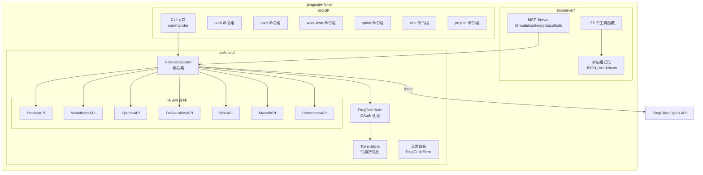
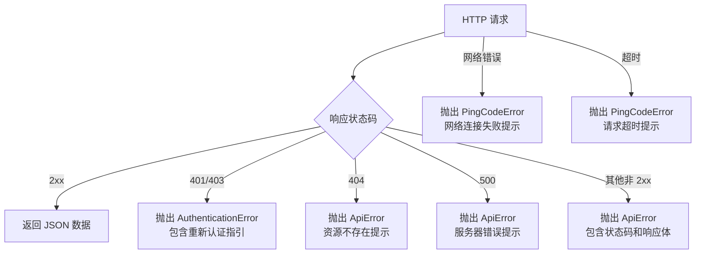

# 技术设计文档：PingCode TypeScript 迁移

## 概述

本设计文档描述将 PingCode MCP Python 项目完整迁移为独立 TypeScript 项目 `pingcode-for-ai` 的技术方案。新项目位于 `d:\projects\pingcode-for-ai`，为独立 git 仓库，采用单包结构，包含三大核心模块：

1. **PingCode API 客户端库**（`src/client/`）— 类型安全的 REST API 封装
2. **MCP Server**（`src/server/`）— 基于 `@modelcontextprotocol/sdk` 的工具服务
3. **CLI 工具**（`src/cli/`）— 基于 Commander 的命令行界面

技术栈从 Python（requests + click + pydantic）全面切换至 TypeScript（fetch + commander + zod + @modelcontextprotocol/sdk），运行时为 Node.js 18+，测试框架为 Vitest。

### 设计目标

- 功能对等：与 Python 版本的所有 API 端点、MCP 工具、CLI 命令一一对应
- 类型安全：利用 TypeScript 严格模式 + Zod 运行时校验，消除运行时类型错误
- 零外部 HTTP 依赖：使用 Node.js 18+ 原生 `fetch`，不引入 axios/node-fetch
- 可测试性：所有模块通过依赖注入支持 mock，测试不发起实际网络请求

## 架构

### 整体架构图



### 目录结构

```
pingcode-for-ai/
├── src/
│   ├── client/                  # PingCode API 客户端库
│   │   ├── index.ts             # 导出入口
│   │   ├── client.ts            # PingCodeClient 主类
│   │   ├── auth.ts              # PingCodeAuth OAuth 认证管理
│   │   ├── token-store.ts       # 令牌文件读写
│   │   ├── errors.ts            # 自定义异常体系
│   │   ├── types.ts             # 公共类型定义
│   │   └── api/                 # 子 API 模块
│   │       ├── stories.ts
│   │       ├── work-items.ts
│   │       ├── sprints.ts
│   │       ├── deliverables.ts
│   │       ├── wiki.ts
│   │       ├── myself.ts
│   │       └── comments.ts
│   ├── server/                  # MCP Server
│   │   ├── index.ts             # 服务入口
│   │   ├── tools/               # 按领域分组的工具注册
│   │   │   ├── product-tools.ts
│   │   │   ├── project-tools.ts
│   │   │   ├── story-tools.ts
│   │   │   ├── work-item-tools.ts
│   │   │   ├── sprint-tools.ts
│   │   │   ├── deliverable-tools.ts
│   │   │   ├── wiki-tools.ts
│   │   │   ├── user-tools.ts
│   │   │   └── comment-tools.ts
│   │   └── format.ts            # 响应格式化（JSON/Markdown）
│   └── cli/                     # CLI 工具
│       ├── index.ts             # CLI 入口
│       ├── client.ts            # 单例 PingCodeClient 访问器
│       ├── output.ts            # 输出格式化
│       └── commands/            # 命令组
│           ├── auth.ts
│           ├── user.ts
│           ├── work-item.ts
│           ├── sprint.ts
│           ├── wiki.ts
│           └── project.ts
├── tests/                       # 测试文件
│   ├── client/
│   │   ├── client.test.ts
│   │   ├── auth.test.ts
│   │   ├── token-store.test.ts
│   │   ├── errors.test.ts
│   │   └── api/
│   │       ├── stories.test.ts
│   │       ├── work-items.test.ts
│   │       ├── sprints.test.ts
│   │       ├── deliverables.test.ts
│   │       ├── wiki.test.ts
│   │       ├── myself.test.ts
│   │       └── comments.test.ts
│   └── server/
│       └── format.test.ts
├── package.json
├── tsconfig.json
├── vitest.config.ts
├── .env.example
├── .gitignore
└── README.md
```

### 关键设计决策

| 决策 | 选择 | 理由 |
|------|------|------|
| HTTP 客户端 | 原生 `fetch` | Node.js 18+ 内置，零依赖 |
| 模块系统 | Node16 (CJS + ESM 兼容) | MCP SDK 和 Commander 均兼容 |
| 运行时校验 | Zod | MCP SDK 原生集成 Zod，替代 Pydantic |
| CLI 框架 | Commander | Node.js 生态标准，替代 Click |
| 测试框架 | Vitest | 原生 TypeScript 支持，快速，替代 pytest |
| 认证令牌存储 | JSON 文件 | 与 Python 版本保持一致，简单可靠 |
| 子 API 延迟加载 | getter 属性 | 与 Python 版本 `@property` 模式对等 |

## 组件与接口

### 1. PingCodeClient（核心类）

```typescript
interface PingCodeClientOptions {
  apiRoot?: string;       // 默认 https://open.pingcode.com
  clientId?: string;
  clientSecret?: string;
  orgId?: string;
  productId?: string;
  code?: string;
  refreshToken?: string;
  authMode?: 'client' | 'user';
}

class PingCodeClient {
  readonly apiRoot: string;
  readonly orgId?: string;
  readonly productId?: string;

  // 延迟加载的子 API 模块（getter）
  get stories(): StoriesAPI;
  get workItems(): WorkItemsAPI;
  get sprints(): SprintsAPI;
  get deliverables(): DeliverablesAPI;
  get wiki(): WikiAPI;
  get myself(): MyselfAPI;
  get comments(): CommentsAPI;

  // HTTP 方法
  get<T = any>(endpoint: string, params?: Record<string, string | number>): Promise<T>;
  post<T = any>(endpoint: string, jsonData?: Record<string, any>): Promise<T>;
  put<T = any>(endpoint: string, jsonData?: Record<string, any>): Promise<T>;
  patch<T = any>(endpoint: string, jsonData?: Record<string, any>): Promise<T>;
  delete<T = any>(endpoint: string): Promise<T>;

  // 顶层便捷方法
  listProducts(pageIndex?: number, pageSize?: number): Promise<PaginatedResponse>;
  getProduct(productId: string): Promise<any>;
  listProjects(pageIndex?: number, pageSize?: number): Promise<PaginatedResponse>;
  getProject(projectId: string): Promise<any>;
  getProjectProperties(projectId: string): Promise<any>;
  listProjectMembers(projectId: string, pageIndex?: number, pageSize?: number): Promise<PaginatedResponse>;
  listEnterpriseUsers(pageIndex?: number, pageSize?: number): Promise<PaginatedResponse>;
  getUser(userId: string): Promise<any>;
}
```

### 2. PingCodeAuth（认证管理器）

```typescript
interface PingCodeAuthOptions {
  clientId?: string;
  clientSecret?: string;
  apiRoot?: string;
  code?: string;
  refreshToken?: string;
  tokenFile?: string;
  authMode?: 'client' | 'user';
}

class PingCodeAuth {
  getToken(): Promise<string>;
  getHeaders(): Promise<Record<string, string>>;
  getAuthorizeUrl(): string;
  getUserToken(code: string): Promise<TokenResponse>;
  getClientToken(): Promise<TokenResponse>;
  refreshUserToken(): Promise<TokenResponse>;
  get isTokenValid(): boolean;
}
```

### 3. TokenStore（令牌持久化）

```typescript
interface TokenData {
  access_token: string;
  refresh_token?: string;
  expires_at?: number;
  auth_mode: string;
  updated_at: number;
}

class TokenStore {
  constructor(filePath: string);
  load(): TokenData | null;
  save(data: TokenData): void;
  clear(): void;
}
```

### 4. 异常体系

```typescript
class PingCodeError extends Error {
  constructor(message: string);
}

class AuthenticationError extends PingCodeError {
  constructor(message: string);
}

class ApiError extends PingCodeError {
  readonly statusCode: number;
  readonly details?: string;
  constructor(message: string, statusCode: number, details?: string);
}
```

### 5. 子 API 模块接口（以 WorkItemsAPI 为例）

```typescript
class WorkItemsAPI {
  constructor(private client: PingCodeClient);

  listWorkItems(options?: ListWorkItemsOptions): Promise<PaginatedResponse>;
  getWorkItem(workItemId: string): Promise<any>;
  createWorkItem(options: CreateWorkItemOptions): Promise<any>;
  updateWorkItem(workItemId: string, options: UpdateWorkItemOptions): Promise<any>;
  deleteWorkItem(workItemId: string): Promise<any>;
  searchWorkItems(keywords: string, projectIds?: string, pageIndex?: number, pageSize?: number): Promise<PaginatedResponse>;
  getWorkItemTypes(projectId: string): Promise<any[]>;
  getWorkItemPriorities(projectId: string): Promise<any[]>;
  getWorkItemStatuses(projectId: string): Promise<any[]>;
  listWorkItemTags(workItemId: string, pageIndex?: number, pageSize?: number): Promise<PaginatedResponse>;
  addWorkItemTag(workItemId: string, tagId: string): Promise<any>;
  removeWorkItemTag(workItemId: string, tagId: string): Promise<any>;
  getWorkItemRelationTypes(): Promise<any[]>;
  // 评论子 API
  listWorkItemComments(workItemId: string, pageIndex?: number, pageSize?: number): Promise<PaginatedResponse>;
  addWorkItemComment(workItemId: string, content: string, parentId?: string): Promise<any>;
  updateWorkItemComment(workItemId: string, commentId: string, content: string): Promise<any>;
  deleteWorkItemComment(workItemId: string, commentId: string): Promise<any>;
}
```

### 6. MCP Server

```typescript
// 使用 @modelcontextprotocol/sdk 的 Server 类
// 每个工具通过 server.tool() 注册，输入参数使用 Zod schema 校验

// 工具注册示例
server.tool(
  'pingcode_list_work_items',
  '获取工作项列表',
  {
    project_ids: z.string().optional(),
    keywords: z.string().optional(),
    page_index: z.number().int().min(0).default(0),
    page_size: z.number().int().min(1).max(100).default(30),
    response_format: z.enum(['json', 'markdown']).default('markdown'),
  },
  async (params) => { /* ... */ }
);
```

### 7. CLI 命令结构

```typescript
// 使用 Commander 框架
const program = new Command('pingcode-for-ai');

program.addCommand(authCommand);    // auth login/status/logout
program.addCommand(userCommand);    // user me
program.addCommand(workItemCommand); // work-item list/get/create/update/delete/search/comment-list/comment-add
program.addCommand(sprintCommand);  // sprint list/get/create/update/delete
program.addCommand(wikiCommand);    // wiki space-list/space-get/space-create/page-get/page-create/page-update
program.addCommand(projectCommand); // project list/get/members
```

## 数据模型

### 公共类型

```typescript
/** 分页响应 */
interface PaginatedResponse<T = any> {
  page_size: number;
  page_index: number;
  total: number;
  values: T[];
}

/** 分页参数 */
interface PaginationParams {
  pageIndex?: number;  // 默认 0
  pageSize?: number;   // 默认 30，最大 100
}

/** 响应格式 */
type ResponseFormat = 'json' | 'markdown';
```

### 令牌数据

```typescript
interface TokenData {
  access_token: string;
  refresh_token?: string;
  expires_at?: number;
  auth_mode: 'client' | 'user';
  updated_at: number;
}

interface TokenResponse {
  access_token: string;
  refresh_token?: string;
  expires_in?: number;
}
```

### 子 API 参数类型（关键示例）

```typescript
/** 工作项列表查询参数 */
interface ListWorkItemsOptions extends PaginationParams {
  projectIds?: string;
  identifier?: string;
  assigneeIds?: string;
  priorityIds?: string;
  sprintIds?: string;
  participantId?: string;
  keywords?: string;
}

/** 创建工作项参数 */
interface CreateWorkItemOptions {
  projectId: string;
  title: string;
  typeId: string;
  description?: string;
  assigneeId?: string;
  stateId?: string;
  priorityId?: string;
  parentId?: string;
  sprintId?: string;
  startAt?: number;
  endAt?: number;
  properties?: Record<string, any>;
}

/** 更新工作项参数 */
interface UpdateWorkItemOptions {
  title?: string;
  description?: string;
  assigneeId?: string;
  stateId?: string;
  priorityId?: string;
  parentId?: string;
  startAt?: number;
  endAt?: number;
  properties?: Record<string, any>;
  phaseId?: string;
  storyPoints?: number;
  estimatedWorkload?: number;
  remainingWorkload?: number;
}

/** 需求列表查询参数 */
interface ListStoriesOptions extends PaginationParams {
  productId?: string;
  storyType?: string;
  statusId?: string;
  priority?: string;
  query?: string;
}

/** 创建迭代参数 */
interface CreateSprintOptions {
  projectId: string;
  name: string;
  startAt: number;
  endAt: number;
  assigneeId: string;
  description?: string;
  status?: string;
  categoryIds?: string[];
}

/** 创建交付目标参数 */
interface CreateDeliverableOptions {
  workItemId: string;
  name: string;
  contentType: string;
  content: Record<string, any>;
}

/** 创建 Wiki 页面参数 */
interface CreatePageOptions {
  spaceId: string;
  name: string;
  content: string;
  formatType?: string;  // 默认 'text'
  parentId?: string;
}
```

### API 端点映射表

| 子模块 | 方法 | HTTP | 端点 |
|--------|------|------|------|
| Client | listProducts | GET | `/v1/scm/products` |
| Client | getProduct | GET | `/v1/scm/products/{id}` |
| Client | listProjects | GET | `/v1/project/projects` |
| Client | getProject | GET | `/v1/project/projects/{id}` |
| Client | getProjectProperties | GET | `/v1/project/projects/{id}/project_properties` |
| Client | listProjectMembers | GET | `/v1/project/projects/{id}/members` |
| Client | listEnterpriseUsers | GET | `/v1/directory/users` |
| Client | getUser | GET | `/v1/directory/users/{id}` |
| Stories | listStories | GET | `/v1/scm/products/{pid}/stories` |
| Stories | getStory | GET | `/v1/scm/products/{pid}/stories/{id}` |
| Stories | getStoryTypes | GET | `/v1/scm/products/{pid}/story_types` |
| Stories | getStoryStatuses | GET | `/v1/scm/products/{pid}/story_statuses` |
| Stories | getStoryPriorities | GET | `/v1/scm/products/{pid}/story_priorities` |
| WorkItems | listWorkItems | GET | `/v1/project/work_items` |
| WorkItems | getWorkItem | GET | `/v1/project/work_items/{id}` |
| WorkItems | createWorkItem | POST | `/v1/project/work_items` |
| WorkItems | updateWorkItem | PATCH | `/v1/project/work_items/{id}` |
| WorkItems | deleteWorkItem | DELETE | `/v1/project/work_items/{id}` |
| WorkItems | getWorkItemTypes | GET | `/v1/project/work_item/types` |
| WorkItems | getWorkItemPriorities | GET | `/v1/project/work_item/priorities` |
| WorkItems | getWorkItemStatuses | GET | `/v1/project/work_item_statuses` |
| WorkItems | listWorkItemTags | GET | `/v1/project/work_items/{id}/tags` |
| WorkItems | addWorkItemTag | POST | `/v1/project/work_items/{id}/tags` |
| WorkItems | removeWorkItemTag | DELETE | `/v1/project/work_items/{id}/tags/{tagId}` |
| WorkItems | getWorkItemRelationTypes | GET | `/v1/project/work_item/relation_types` |
| WorkItems | listWorkItemComments | GET | `/v1/project/work_items/{id}/comments` |
| WorkItems | addWorkItemComment | POST | `/v1/project/work_items/{id}/comments` |
| WorkItems | updateWorkItemComment | PATCH | `/v1/project/work_items/{id}/comments/{cid}` |
| WorkItems | deleteWorkItemComment | DELETE | `/v1/project/work_items/{id}/comments/{cid}` |
| Sprints | listSprints | GET | `/v1/project/projects/{pid}/sprints` |
| Sprints | createSprint | POST | `/v1/project/projects/{pid}/sprints` |
| Sprints | updateSprint | PATCH | `/v1/project/projects/{pid}/sprints/{id}` |
| Sprints | getSprint | GET | `/v1/project/projects/{pid}/sprints/{id}` |
| Sprints | deleteSprint | DELETE | `/v1/project/projects/{pid}/sprints/{id}` |
| Deliverables | createDeliverable | POST | `/v1/project/deliverables` |
| Deliverables | updateDeliverable | PATCH | `/v1/project/deliverables/{id}` |
| Deliverables | deleteDeliverable | DELETE | `/v1/project/deliverables/{id}` |
| Deliverables | listDeliverables | GET | `/v1/project/work_items/{id}/deliverables` |
| Wiki | listSpaces | GET | `/v1/wiki/spaces` |
| Wiki | getSpace | GET | `/v1/wiki/spaces/{id}` |
| Wiki | createSpace | POST | `/v1/wiki/spaces` |
| Wiki | updateSpace | PATCH | `/v1/wiki/spaces/{id}` |
| Wiki | deleteSpace | DELETE | `/v1/wiki/spaces/{id}` |
| Wiki | createPage | POST | `/v1/wiki/pages` |
| Wiki | getPage | GET | `/v1/wiki/pages/{id}` |
| Wiki | getPageContent | GET | `/v1/wiki/pages/{id}/content` |
| Wiki | updatePageContent | PUT | `/v1/wiki/pages/{id}/content` |
| Wiki | getPageVersions | GET | `/v1/wiki/pages/{id}/versions` |
| Wiki | getSpacePages | GET | `/v1/wiki/pages` |
| Wiki | addSpaceMember | POST | `/v1/wiki/spaces/{id}/members` |
| Wiki | updateSpaceMember | PATCH | `/v1/wiki/spaces/{id}/members/{mid}` |
| Wiki | removeSpaceMember | DELETE | `/v1/wiki/spaces/{id}/members/{mid}` |
| Wiki | getSpaceMembers | GET | `/v1/wiki/spaces/{id}/members` |
| Myself | getMyself | GET | `/v1/myself` |
| Comments | listComments | GET | `/v1/comments` |
| Comments | createComment | POST | `/v1/comments` |


## 正确性属性

*属性（Property）是系统在所有有效执行中都应保持为真的特征或行为——本质上是对系统应做什么的形式化陈述。属性是人类可读规格说明与机器可验证正确性保证之间的桥梁。*

### 属性 1：子 API 端点路由正确性（往返属性）

*对于任意*子 API 模块的任意方法调用，传递给底层 `PingCodeClient` HTTP 方法（get/post/put/patch/delete）的端点路径，应当与 API 端点映射表中定义的 URL 模式完全匹配。即：给定方法名和参数，可以确定性地推导出预期端点路径，且实际调用的端点路径与之一致。

**Validates: Requirements 4.1, 4.2, 4.4, 5.1, 5.2, 5.5, 5.6, 5.7, 6.1, 6.4, 6.5, 7.1, 7.2, 7.3, 7.4, 8.1, 8.2, 8.3, 9.2, 9.3, 13.1, 13.2, 13.3, 13.4, 13.5, 14.1, 14.2, 14.3, 14.4, 15.6**

### 属性 2：HTTP 请求构造正确性

*对于任意* HTTP 方法（GET/POST/PUT/PATCH/DELETE）、任意端点路径和任意参数组合，`PingCodeClient` 发出的 `fetch` 调用应满足：
- URL 为 `apiRoot + endpoint`（GET 请求附加查询参数）
- method 与调用的方法名一致
- headers 包含 `Authorization: Bearer <token>` 和 `Content-Type: application/json`
- POST/PUT/PATCH 请求的 body 为 JSON 序列化的参数对象

**Validates: Requirements 2.1, 2.4**

### 属性 3：非认证错误状态码分类

*对于任意*非 2xx 且非 401/403 的 HTTP 状态码（如 400、404、500 等），`PingCodeClient` 应抛出 `PingCodeError`（而非 `AuthenticationError`），且错误对象包含该状态码信息。

**Validates: Requirements 2.6**

### 属性 4：令牌持久化往返

*对于任意*有效的 `TokenData` 对象（包含 access_token、可选的 refresh_token、expires_at 和 auth_mode），通过 `TokenStore.save()` 保存后再通过 `TokenStore.load()` 加载，应返回与原始数据等价的对象。

**Validates: Requirements 3.4**

### 属性 5：令牌过期判断

*对于任意* `expires_at` 时间戳，当当前时间距 `expires_at` 不足 86400 秒（1 天）时，`isTokenValid` 应返回 `false`；当距离超过 86400 秒时，应返回 `true`。

**Validates: Requirements 3.6**

### 属性 6：授权 URL 构造

*对于任意*非空 `clientId` 和 `apiRoot`，`getAuthorizeUrl()` 生成的 URL 应以 `apiRoot` 为前缀，包含 `response_type=code` 和 `client_id={clientId}` 查询参数。

**Validates: Requirements 3.7**

### 属性 7：变更操作请求体构造

*对于任意*变更操作（create/update）的参数对象，传递给底层 HTTP 方法的请求体应：
- 包含所有值不为 `undefined` 的字段
- 不包含值为 `undefined` 的字段
- 必填字段始终存在于请求体中

**Validates: Requirements 5.3, 5.4, 6.2, 6.3, 7.1, 7.2**

### 属性 8：响应格式化一致性

*对于任意*数据对象和格式选项：
- 当格式为 `json` 时，返回值应为原始数据（或包装为 `{data: ...}` 的对象）
- 当格式为 `markdown` 时，返回值应为字符串类型
- 当数据包含 `items` 数组时，Markdown 输出应包含表格格式

**Validates: Requirements 11.5**

### 属性 9：分页参数上限约束

*对于任意*分页方法调用，当传入的 `pageSize` 超过 100 时，实际传递给 API 的 `page_size` 参数应被限制为 100。当 `pageSize` 不超过 100 时，应原样传递。

**Validates: Requirements 13.6**

## 错误处理

### 错误分类策略



### 错误消息格式化

每种错误类型提供包含可操作建议的消息：

| 错误类型 | 消息模板 |
|----------|----------|
| 认证失败 (401/403) | `{操作}失败: 认证失败\n请检查：\n1. access_token 是否过期\n2. 重新运行授权流程` |
| 权限不足 (403) | `{操作}失败: 权限不足\n请检查当前用户权限` |
| 资源不存在 (404) | `{操作}失败: 资源不存在\n请检查 ID 是否正确` |
| 服务器错误 (500) | `{操作}失败: 服务器错误\n请稍后重试` |
| 网络错误 | `{操作}失败: 网络请求失败\n请检查网络连接` |

### 认证错误恢复

- OAuth 令牌过期时自动尝试刷新（user 模式用 refresh_token，client 模式重新获取）
- 刷新失败时抛出包含完整重新认证步骤的错误消息
- CLI 的 `auth login` 命令提供手动重新认证入口

## 测试策略

### 测试框架与工具

- **Vitest**：测试运行器和断言库
- **fast-check**：属性测试库（Property-Based Testing）
- **vi.fn() / vi.spyOn()**：Vitest 内置 mock 功能，替代 Python 的 `unittest.mock`

### 双重测试方法

#### 1. 属性测试（Property-Based Testing）

使用 `fast-check` 库验证本设计文档中定义的 9 个正确性属性。每个属性测试：
- 最少运行 100 次迭代
- 使用 `fc.string()`、`fc.integer()`、`fc.record()` 等生成器产生随机输入
- 通过注释标注对应的设计属性：`// Feature: typescript-migration, Property N: {title}`

关键属性测试实现策略：

| 属性 | 生成器策略 | 验证方式 |
|------|-----------|----------|
| 属性 1（端点路由） | 生成随机 ID 字符串（alphanumeric），随机选择子 API 方法 | mock client HTTP 方法，断言调用的端点匹配预期模式 |
| 属性 2（HTTP 请求） | 生成随机端点、随机参数对象 | mock fetch，断言 URL、method、headers、body |
| 属性 3（错误分类） | 生成随机非 2xx 非 401/403 状态码 | mock fetch 返回对应状态码，断言抛出 PingCodeError |
| 属性 4（令牌往返） | 生成随机 TokenData | save 后 load，深度比较 |
| 属性 5（过期判断） | 生成随机时间戳 | 计算与当前时间差，断言 isTokenValid 结果 |
| 属性 6（授权 URL） | 生成随机 clientId 和 apiRoot | 解析 URL，断言包含正确参数 |
| 属性 7（请求体构造） | 生成随机参数对象（部分字段为 undefined） | mock HTTP 方法，断言 body 不含 undefined 字段 |
| 属性 8（响应格式化） | 生成随机数据对象和格式选项 | 断言 JSON 返回对象、Markdown 返回字符串 |
| 属性 9（分页上限） | 生成随机 pageSize（0-1000） | 断言传递的 page_size ≤ 100 |

#### 2. 单元测试（Example-Based）

针对具体场景和边界条件：

- **PingCodeClient**：延迟加载验证、配置优先级、30 秒超时、401/403 错误处理
- **PingCodeAuth**：client/user 模式选择、凭据缺失错误、模式不匹配忽略缓存
- **异常体系**：继承关系、属性存在性
- **MCP Server**：ping 工具、错误格式化各类型
- **CLI**：version 命令、--format 选项解析

### 测试文件组织

```
tests/
├── client/
│   ├── client.test.ts          # PingCodeClient 单元测试 + 属性 2, 3
│   ├── auth.test.ts            # PingCodeAuth 单元测试 + 属性 5, 6
│   ├── token-store.test.ts     # TokenStore 单元测试 + 属性 4
│   ├── errors.test.ts          # 异常体系单元测试
│   └── api/
│       ├── stories.test.ts     # StoriesAPI 单元测试 + 属性 1 (stories 部分)
│       ├── work-items.test.ts  # WorkItemsAPI 单元测试 + 属性 1, 7 (work-items 部分)
│       ├── sprints.test.ts     # SprintsAPI 单元测试 + 属性 1, 7 (sprints 部分)
│       ├── deliverables.test.ts
│       ├── wiki.test.ts
│       ├── myself.test.ts
│       └── comments.test.ts
├── server/
│   └── format.test.ts          # 响应格式化 + 属性 8
└── shared/
    └── pagination.test.ts      # 分页参数 + 属性 9
```

### Mock 策略

- **fetch mock**：使用 `vi.fn()` mock 全局 `fetch`，验证请求参数而非发起实际请求
- **文件系统 mock**：TokenStore 测试使用临时目录，测试后清理
- **时间 mock**：令牌过期测试使用 `vi.useFakeTimers()` 控制当前时间
